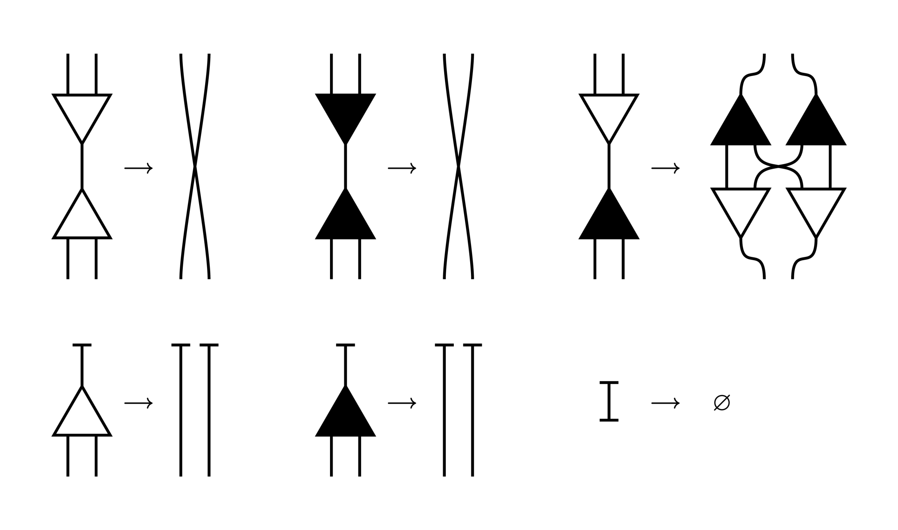

# py-ivm

A python runtime for interaction combinators.
Compatible with VineLang's [ivy](https://github.com/VineLang/vine/tree/main/ivy) syntax.

## installation

You can clone and install with pip directly 

```
git clone https://github.com/corps/py-ivm
cd py-ivm
pip install .
```

Or use the nix flake included.

# Interaction Networks

[Interaction nets](https://en.wikipedia.org/wiki/Interaction_nets) are a metaphor for computation using network graphs connected via 'wires'.

One of [the first papers](https://dl.acm.org/doi/pdf/10.1145/96709.96718) about this idea has been around since the 90s, and since then more refinements have pushed it to being practical and useful.

The core idea of an interaction net is similar to a directed graph, except that the "direction" of the graph is not determined merely by edges or nodes alone, but by the "orientation" of ports between nodes that are connected by an edge.  Each node has a single "principal port", and some arbitrary amount of auxilary ports to which edges *may* connect.  When two nodes are connected by their principal ports, based on some property of the connected nodes, the graph can be "rewritten" locally such that the edges extending from both nodes are preserved, but all other details are governed by the interaction rule of the reduction.  

In this way, the "direction" of computation can change, as the rewrite rule could connect the preserved edges into new principal ports (thus 'pointing' further reductions back along that wire), "auxilary ports" (thus 'pointing' reductions to some yet computed destination), or even to other edges (such as forming a node-less circuit and ending further reductions)

In Interaction Net parlance, edges are called "wires" as rewrite rules can attach and move "edges" in a graph in ways that easier to imagine as bendable wires.  Furthermore, nodes tend to be called "agents" as properties of those nodes determine one half of interaction reductions as they "explore" the graph through rewrites.

## Interaction Combinators

Of course, to make Interaction Networks more practically useful, we need a few more definitions and formalisms to give them practical shape.  One way of doing so is to formalize a group of combinators that describe a usefully minimal system of computation.

[Original Interaction Combinators Paper](https://pdf.sciencedirectassets.com/272575/1-s2.0-S0890540100X00600/1-s2.0-S0890540197926432/main.pdf)


## Ivy, an interaction combinator programming language

Building on this, you can define a "calculus" on interaction nets.  One such implementation is [ivy](https://github.com/VineLang/vine/tree/main/ivy).

An ivy program extends symmetric combinators with some additional semantics that simplify practical computation.  For one, it introduces extrinsics -- that is, nilary agents that represent "values of external meaning", and binary agents that represent "functions of external application".  Furthermore, it introduces the concept of "globals", that is, named network abstractions with "free" wires that can be expanded upon interaction.

`py-ivm`, this project, implements a runtime that is compatible with the syntax of ivy programs, but is embedded in python.  This would allow for python values and functions themselves to become extrinsics to programs expressed in ivy.

That said, there is yet another level of abstraction that provides a fully featured language on top of this.

## Vine, a general purpose programming language that compiles to ivy

Vine, implements a compiler that takes a higher level **typed** programming language and "compiles to" untyped ivy.  This allows for it to express novel features, in particular (Inverse Variables)[https://vine.dev/docs/features/inverse] which reverse the order of time by allowing assignments to execute usages that occur *before* rather than *after* the assignment.  This can be mixed with traditional variables that abstract over future assignments.  The result is the ability to "weave" abstractions in the same code that behave in independent timelines.

## Useful Links and Papers

* (An Illustrated Guide To Interaction Networks)[https://t6.fyi/guides/inets]
* (Another Illustrated Interaction Network Guide)[https://zicklag.katharos.group/blog/interaction-nets-combinators-calculus/]
* [Symmetrical Interaction Combinators](https://lipn.univ-paris13.fr/~mazza/papers/CombSem-MSCS.pdf)